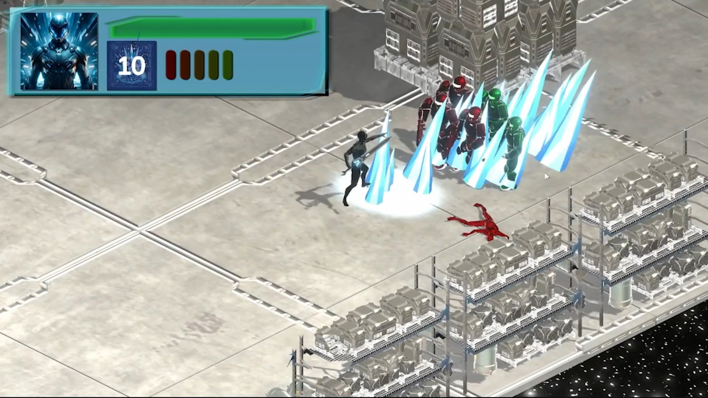
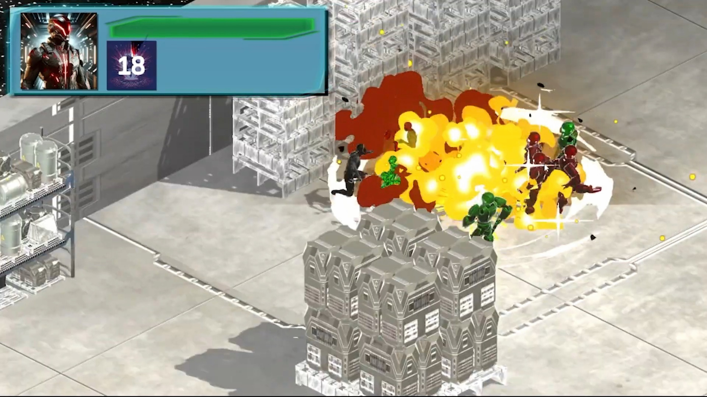
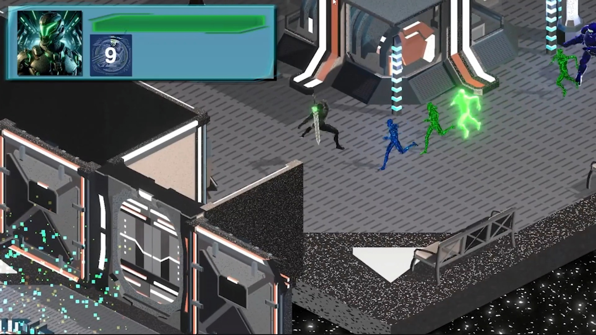
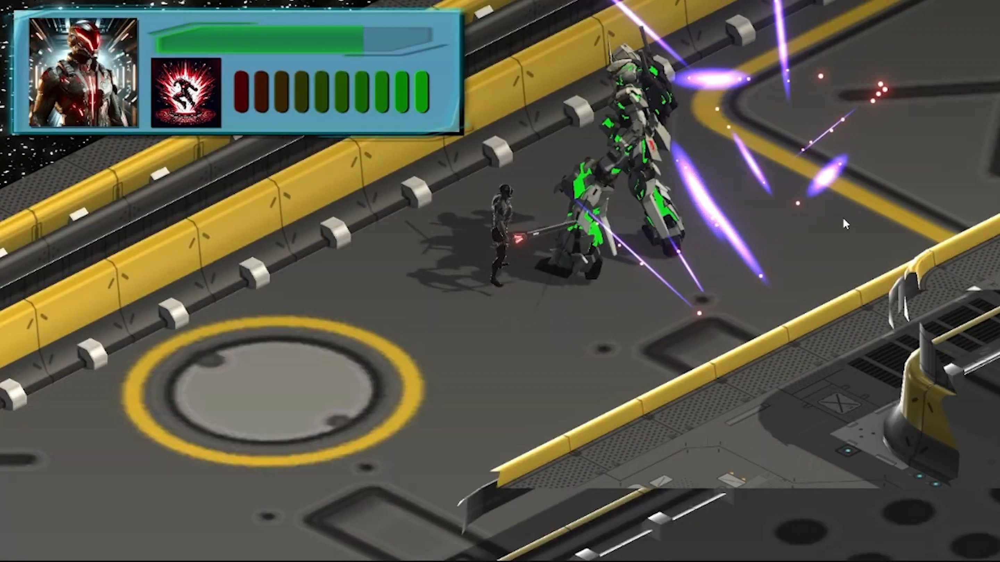
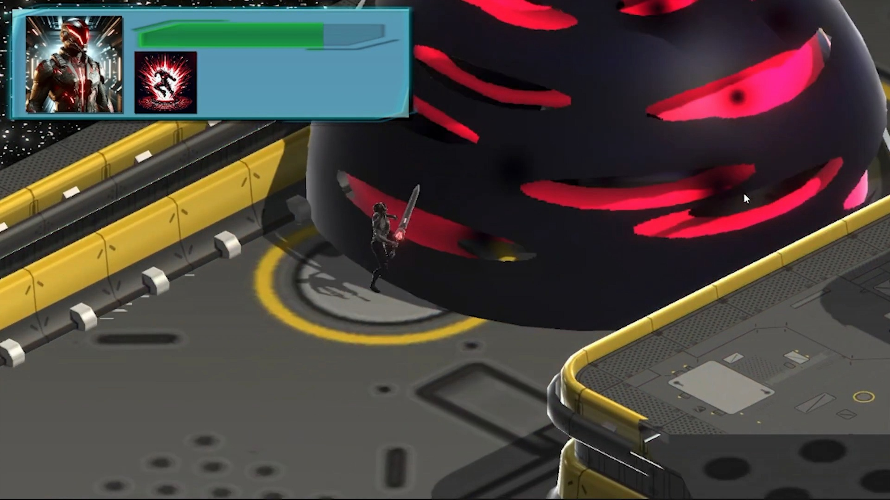
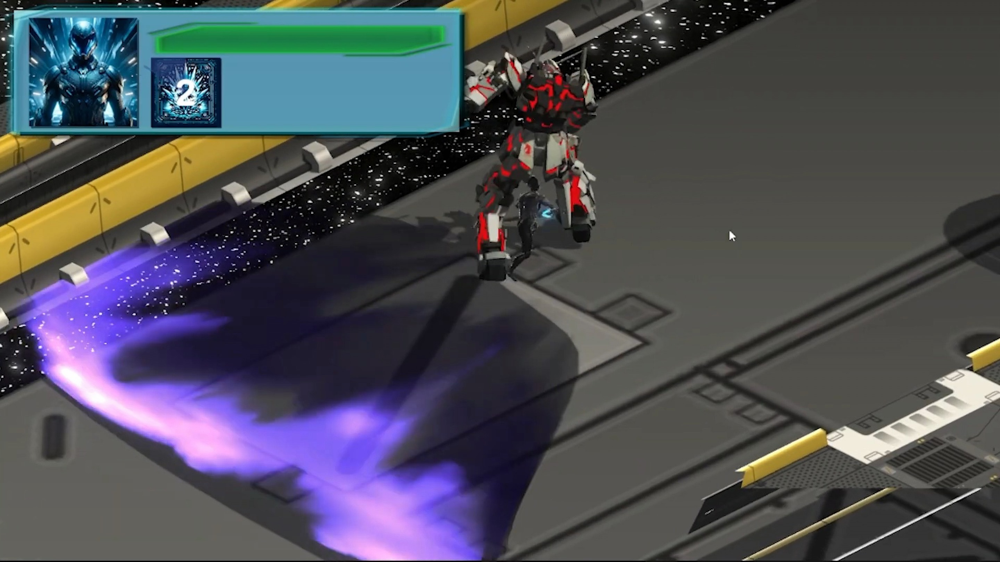
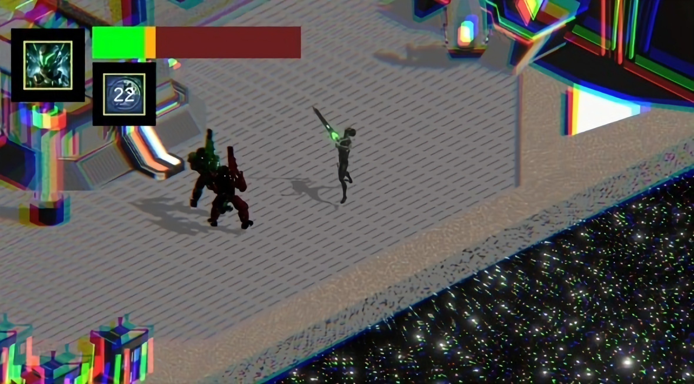

# 🎮 Hue Havoc

A fast-paced isometric action game built in **Unity**, where players switch between elemental states (Red, Green, Blue) to battle color-coded enemies and unleash powerful abilities.

---

## 🔧 Features

- 🔁 **Color-Based Combat System**  
  Switch between Red, Green, and Blue states, each with unique visuals and enemy interactions.

- ⚔️ **Elemental Skills**  
  - 🔵 Ice: AoE freeze + slow  
  - 🔴 Fire: Explosion + burn damage (DOT)  
  - 🟢 Warp: Teleport to furthest enemy  
  - 💥 Ultimate: Multi-phase slashing barrage

- 🧠 **Strategic Enemy Matchups**  
  Rock-paper-scissors color system: Blue > Red > Green > Blue.

- 👹 **Boss Fights with Phases & Abilities**  
  Slam, Pull, Force Field, Bullet Barrage — synced with state changes.

- 🎨 **Custom VFX & Shader Effects**  
  Ice shards, fire trails, warp glows, sword trails, dash effects, dissolve visuals.

- 📸 **Isometric Cinemachine Camera**  
  With shake effects, bloom, and post-processing for feedback.

- 🎮 **Modular Combo & Skill System**  
  ScriptableObject-driven attacks, scalable for future skills and content.

---

## 🖼️ Screenshots

### Combat – Ice Skill  

### Combat – Fire Skill  

### Combat – Warp Skill  

### Ultimate Ability  

### Boss
|                              |
|:----------------------------:|
|  |
| **Boss Invincible** |
|  |
| **Boss Pull** |

### Player Take Damage

---

## 🎬 Trailer  

  

